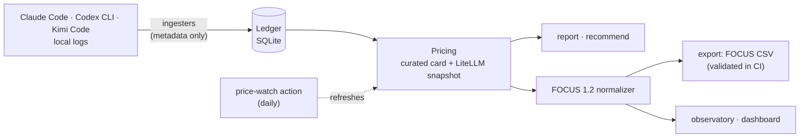

# tokencur

[](https://github.com/pach-boop/tokencur/actions/workflows/ci.yml)
[](https://pypi.org/project/tokencur/)
[](https://scorecard.dev/viewer/?uri=github.com/pach-boop/tokencur)
[](https://github.com/pach-boop/tokencur/blob/main/pyproject.toml)
[](https://github.com/pach-boop/tokencur/blob/main/LICENSE)

**The CUR for your tokens** — an open-source pipeline that turns AI usage into
[FOCUS](https://focus.finops.org)-conformant cost datasets, validated in CI by the
FinOps Foundation's own validator. Today it reads the local logs of three coding
agents — Claude Code, Codex CLI and Kimi Code — prices them against 290+ models, and
adds unit economics, savings recommendations and a local ledger that keeps the history
after the agents delete their logs.

> A FinOps tool that practices FinOps on itself: the first dataset is my own real AI spend.

## Why

- **AI cost management is the #1 skill gap in FinOps** (State of FinOps 2026: 98% of
  organizations now manage AI spend).
- **FOCUS already supports tokens** — the spec has columns for token/credit-based billing,
  with OpenAI usage as an official example. The standard is ready; open implementations
  are not.
- The FinOps Foundation's [`focus_converters`](https://github.com/finopsfoundation/focus_converters)
  covers AWS, GCP, Azure and OCI — **zero AI providers**. tokencur aims to contribute an
  AI-provider converter upstream.

## Related work

| Category | Projects | How tokencur differs |
|---|---|---|
| Dev observability | Langfuse, Helicone, LiteLLM | Per-request tracing; no FOCUS output, no finance vocabulary |
| Coding-agent trackers | ccusage, tokscale, TokenTracker, [tokentop](https://github.com/tokentopapp/tokentop), [budi](https://github.com/siropkin/budi) | Dashboards and live monitors (budi also attributes each call to a repo, branch and ticket); none exports FOCUS or keeps a finance vocabulary |
| Cost per commit | [agent-cost](https://github.com/lucianareynaud/agent-cost) | Links a cost you log by hand after each session to the commits it produced; tokencur attributes every call from the agents' own logs, with no manual step |
| Enterprise platforms | Finout, Vantage, CloudZero | FOCUS-aligned but closed source and enterprise-priced |
| Plumbing | OpenCost OpenAI plugin, focus_converters | k8s-bound / cloud-only; tokencur is standalone, multi-provider, analyst-friendly |

## Design principles

1. **Privacy by construction** — ingestion reads usage metadata only (tokens, models,
   timestamps). Conversation content is never extracted.
2. **Measure existing spend, don't generate spend to measure** — the first data source is
   local Claude Code session logs, which already exist on disk. Budget: ~$0.
3. **List-cost showback** — subscription usage isn't billed per token, so costs are
   computed as *API-equivalent list cost*. Pricing has two layers: a curated, dated
   Anthropic rate card ([`pricing.py`](https://github.com/pach-boop/tokencur/blob/main/src/tokencur/pricing.py)) that always wins, and a
   vendored snapshot of the community-maintained
   [LiteLLM price database](https://github.com/BerriAI/litellm) as fallback (290+ live
   models across Anthropic, OpenAI, Gemini, DeepSeek, Kimi/Moonshot, GLM/Z.ai and
   Ollama, refreshed daily by the [price-watch action](https://github.com/pach-boop/tokencur/blob/main/.github/workflows/price-watch.yml);
   models LiteLLM retires keep their last known rate, so historical usage stays priced).
   Unknown models surface as *unpriced usage* rather than silently costing $0.
   Rates are point-in-time: each call is valued at the list rate in force on its
   day, from a rate history the snapshot keeps. Request options that change the
   price are applied as Claude Code logs them: fast mode (2x), US-only inference
   (1.1x) and the Batch API (0.5x).
4. **Explainable over clever** — every line that ships is one the maintainer fully
   understands and can defend.
5. **Reproducible figures** — the report, the export and the observatory name what
   produced each number: the tokencur version, the curated card's date and the
   pricing snapshot's SHA-256. Each release publishes and attests that same snapshot
   file, so anyone can rerun a figure on the exact prices behind it.

## Architecture



Each design decision, with its context and its cost, is recorded as an
[architecture decision record](https://github.com/pach-boop/tokencur/blob/main/docs/adr/README.md).

One module per layer — [`ingest/`](https://github.com/pach-boop/tokencur/tree/main/src/tokencur/ingest) (one adapter per source),
[`ledger`](https://github.com/pach-boop/tokencur/blob/main/src/tokencur/ledger.py), [`pricing`](https://github.com/pach-boop/tokencur/blob/main/src/tokencur/pricing.py),
[`focus`](https://github.com/pach-boop/tokencur/blob/main/src/tokencur/focus.py) — with the commands on top. Every command loads
records through one function, [`sources.load_records()`](https://github.com/pach-boop/tokencur/blob/main/src/tokencur/sources.py).

## Quickstart

Requires Python 3.11+. No runtime dependencies.

```bash
pip install tokencur
tokencur report                # cost summary in your terminal
tokencur export focus.csv      # FOCUS 1.2 conformant dataset
tokencur recommend             # avoided cost + what-if headroom
tokencur export sept.csv --since 2026-09-01 --until 2026-10-01   # one billing period
tokencur doctor                # read-only health check: log formats, ledger, pricing
tokencur import runpod FILE    # billed cost: a RunPod billing export
tokencur outcomes [REPO...]    # usage value per commit, repository by repository
```

`tokencur --help` lists every command, and `python -m tokencur` works the same.
Under a negotiated contract, `--discounts discounts.json` (for example
`{"discounts": {"Anthropic": 0.15}}`) keeps the public price in FOCUS `ListCost`
and puts the contracted price in `ContractedCost`, `EffectiveCost` and
`BilledCost`; the report adds a contracted total. The export stays in USD, the
currency every provider bills in; `tokencur report --currency MXN --fx-rate
18.37` also shows totals at a rate you give (nothing is fetched).
Periods are UTC days with `--until` excluded, the way a billing period is cut.

With no arguments it scans every known local source on your machine — **Claude Code**
(`~/.claude/projects`), **Codex CLI** (`~/.codex/sessions`) and **Kimi Code**
(`~/.kimi-code/sessions`) — and prints per-model, per-source and per-day
API-equivalent cost, including provider-correct cache economics. Each scan
is also kept in a local [ledger](https://github.com/pach-boop/tokencur#ledger), so history survives when the
agents delete their old logs.

For the visual version — daily trend, cost by model, token-type mix and unit
economics, each view exposing the DuckDB SQL behind it:

From a clone of this repository:

```bash
pip install -e ".[dashboard]"
streamlit run src/tokencur/dashboard.py
```

Real output over the maintainer's own machine on 2026-10-02 (10.7k model calls
from ~400 MB of logs, 1.8 s), trimmed:

```text
model                                 calls       input     output     cache_read  cache_write  cost USD
claude-opus-5-5                       2,545       5,230  4,453,008  1,039,768,719   21,810,960    471.43
gpt-5.4                               2,790  34,683,046  1,807,104    304,527,488            0    189.95
gpt-5.3-codex                         5,010  26,148,134  1,997,552    377,040,128            0    139.71
claude-fable-5-1                         14         418     64,013      1,732,662      185,892      7.36
gpt-5.2-codex                           139     347,399     71,796      4,995,072            0      2.49
...

by source:
  claude-code   $482.51
  codex         $332.95
  kimi-code     $2.44

API-EQUIVALENT TOTAL (showback): $817.90
```

## Performance

On the maintainer's machine the full pipeline reads 10.7k model calls from
~400 MB of real logs in 1.8 s. Real transcripts carry the conversations,
which tokencur skips. For scale,
[`scripts/benchmark.py`](https://github.com/pach-boop/tokencur/blob/main/scripts/benchmark.py) times every stage on synthetic
metadata-only logs (Python 3.13, Intel i7-1355U, Linux):

| Stage | 100k messages | 1M messages |
|---|---:|---:|
| Scan logs (38 MB / 376 MB) | 0.6 s | 6.3 s |
| Ledger write | 0.2 s | 2.5 s |
| Rescan, adds nothing | 0.2 s | 2.4 s |
| Ledger read | 0.4 s | 5.1 s |
| Report | 0.1 s | 1.4 s |
| FOCUS export (0.4M / 4M rows) | 5.6 s | 55.9 s |
| Peak memory | 139 MB | 1.1 GB |

Time grows linearly. The benchmark holds the scanned and the stored history at
once, so its peak memory is about twice what one command needs. Reproduce with
`python scripts/benchmark.py --messages 1000000 --files 2000`.

## Ledger

Coding agents treat their logs as disposable: Claude Code deletes session
transcripts after `cleanupPeriodDays` (30 days by default). Computed from the
logs alone, totals would *shrink* as history disappears. So every command —
`report`, `export`, `recommend`, the observatory and the dashboard — first
keeps what it scans in a local SQLite ledger, then reports the ledger's full
history:

- **Deduplicated per usage event** — re-running adds nothing, and a resumed
  session's copied messages count once.
- **Nothing is forgotten** — events whose logs are gone keep their last known
  values; events still on disk are refreshed from the latest parse.
- **Metadata only** — token counts, models, timestamps, workspace and session
  ids, the directory each call ran in, in a file readable by its owner only.
- **Location** — `~/.local/share/tokencur/ledger.sqlite3` (honours
  `$XDG_DATA_HOME`), or wherever `$TOKENCUR_LEDGER` points.
- **Corrections are audited, not erased** — the schema is versioned and
  migrated in place. Before an upgrade the file is copied to
  `ledger.sqlite3.schema-N.bak`, and rows a later version finds were not
  usage move to a `superseded` table with when and why. Schema 2 retired the
  Codex re-sent reports earlier versions double counted (see the changelog);
  schema 3 records each call's price-changing request options, schema 4 billed
  charges, and schema 5 the directory each call ran in.

The ledger keeps only what it has seen: usage deleted before the first run is
gone. An explicit path (`python -m tokencur report ROOT`) is reported as-is and
never stored.

## Billed cost

Showback values usage at list price; a bill is what a provider actually took.
RunPod is the first billed source: `scripts/fetch_runpod_billing.py` saves the
billing history from RunPod's REST API (the one step that goes online, when you
run it), and `tokencur import runpod FILE` keeps it in the ledger. Reports show
it as a separate total, "BILLED (real money, from provider bills)", the FOCUS
export gains Compute rows whose `BilledCost` is the billed amount, and the
observatory shows it as actual money outside subscription leverage
([ADR 0009](https://github.com/pach-boop/tokencur/blob/main/docs/adr/0009-billed-charges-next-to-showback.md)).

## Unit economics: usage value per commit

Cost alone does not say whether usage paid off. `tokencur outcomes` sets it
against the commits it went into, per git repository:

```
repository                              days  calls  usage value  commits  agent   lines  per commit
~/Proyectos/tokencur  2026-09-24..2026-10-02    424       $70.78       40     40  10,824       $1.77
```

- **Attribution by where each call ran.** Agents log the working directory of
  every call, and the call belongs to the git repository that holds it. Usage
  outside any repository, or in a directory since deleted, is reported as
  unattributed, never spread.
- **Your commits in the days with usage.** Non-merge commits by your
  `user.email` (or `--all-authors`), within `--since`/`--until` or else the
  repository's days with agent usage. Agent-signed commits and lines changed
  are shown as context.
- **Read-only and local.** git runs on your repositories; nothing is sent.

A commit is a coarse unit: it measures output, not quality. The useful
comparison is a repository with itself over time. Quality, latency and
reliability are the next layers
([ADR 0010](https://github.com/pach-boop/tokencur/blob/main/docs/adr/0010-usage-value-per-commit.md)).

## When an agent changes its logs

Agents change their log formats without notice. `tokencur doctor` scans every
source read-only and reports files, usage lines, records, unreadable lines and
the agent versions the logs name. It flags what looks like a format change:
log files with no usage lines, usage lines that yield no records, or more than
1% unreadable lines. It also checks the ledger's schema and SQLite integrity
and prints the pricing snapshot's SHA-256. It exits 1 when anything needs
attention. A malformed line is skipped, never guessed at, and never stops a
scan.

It also reconciles tokencur with Claude Code's own accounting. When a session
ends, Claude Code writes the cost it counted for each model, including calls it
never writes to the transcript. `doctor` compares that with tokencur's value of
the same sessions, and flags a gap either way: below 85% means calls are going
missing, above 105% means calls are being counted twice.

## Money concepts (read before quoting numbers)

tokencur's headline figures are **not** a bill. Three money concepts, kept
deliberately apart:

- **Actual outlay** — the subscription fees really paid, declared plan by plan
  in [`subscriptions.json`](https://github.com/pach-boop/tokencur/blob/main/subscriptions.json) with the days each plan was
  active, and provider bills imported as billed charges (see
  [Billed cost](https://github.com/pach-boop/tokencur#billed-cost)). The only real money here.
- **Usage value (showback)** — what the same usage would cost at API list
  prices. Subscriptions don't bill per token, so tokencur *values* the usage
  instead of pretending to bill it.
- **Counterfactuals** — cost avoided by provider caching, and what-if
  right-sizing. Properties of the workload, not actions taken. Under a flat
  subscription, right-sizing buys rate-limit headroom, not dollars.

Divide value by outlay and you get the observatory's headline metric:
**subscription leverage** — how many times over the fees pay for themselves.

A plan counts only while it was active. `from` is its first day and `until` the
first day it no longer applied, like a billing period; an upgrade is two plans:

```json
{"plans": {"Claude Code": [
  {"monthly_usd": 20, "from": "2026-09-24", "until": "2026-10-02"},
  {"monthly_usd": 100, "from": "2026-10-02"}
]}}
```

A flat `monthly_usd` fee per service still works and counts across the whole
window.

## Observatory

A public, static snapshot of this repository's own AI spend — the FOCUS dataset
rendered as a dashboard: **https://pach-boop.github.io/tokencur/observatory/**

```bash
tokencur observatory   # regenerates docs/observatory/
```

The snapshot publishes aggregates only (day × service, model and token-bucket
totals) — workspace names, session ids and message content never enter the
output, and the page is fully self-contained (no external requests). Like the
pricing snapshot, it is committed deliberately: the site updates when the
maintainer decides, not on a schedule.

## Price card

The public list rates tokencur values usage against, and a dated change log
built from the git history of the pricing snapshot:
**https://pach-boop.github.io/tokencur/prices/**

```bash
tokencur prices   # regenerates docs/prices/
```

A daily [price-watch action](https://github.com/pach-boop/tokencur/blob/main/.github/workflows/price-watch.yml) refreshes the
vendored snapshot and commits whenever it changes, with a message that names
what moved (rate moves, models added, models retired upstream and kept at their
last rate), then regenerates this page from that history.

## Roadmap

| Phase | Deliverable | Status |
|---|---|---|
| 1 | Repo, thesis, related work | ✅ |
| 2 | Ingest real usage: local agent logs; Anthropic/OpenAI admin-API exports | 🔨 Claude Code, Codex CLI and Kimi Code done; API exports pending |
| 3 | FOCUS normalizer + CSV export, gated in CI by the [Foundation's own validator](https://github.com/finopsfoundation/focus_validator), cross-checked against [official sample data](https://github.com/FinOps-Open-Cost-and-Usage-Spec/FOCUS-Sample-Data) | ✅ |
| 4 | DuckDB + Streamlit dashboard: trends, top spend, unit economics | ✅ v1 |
| 5 | Recommendation engine: caching ROI (measured) + model right-sizing (what-if) | ✅ v1 — batch and local-vs-API break-even need user-supplied inputs, next |
| 6 | Serverless AWS deployment, documented, with its own measured running cost | ⏳ |
| 7 | PR to `focus_converters` + bilingual (EN/ES) case study | ⏳ |

## Limitations (honest)

- Usage comes from three coding agents' local logs (Claude Code, Codex CLI, Kimi
  Code); billed cost from RunPod exports. The
  [Anthropic and OpenAI admin cost APIs](https://github.com/pach-boop/tokencur/issues/7)
  are next and wait on real response samples.
- The ledger can only keep usage it has seen. Run tokencur more often than
  Claude Code's `cleanupPeriodDays`, or raise that setting in
  `~/.claude/settings.json`.
- Codex calls are counted when the session's running total moves; per session,
  the counted calls reconcile exactly with Codex's own running total (all 94 of
  the maintainer's rollouts). A forked session that re-copies earlier calls
  counts them once, in a scan and in the ledger, even after the original log is
  gone: a copy is recognized by its timestamp and raw usage, so two distinct
  calls identical to the millisecond would also count once (never observed).
- Costs are list-price showback, not invoices. Subscription plans bill differently.
- Claude Code makes calls it never writes to its transcripts: internal calls to
  smaller models for web search, web fetch and session titles, and some
  main-model calls such as compaction. Its own end-of-session counters show
  tokencur's Claude Code value is a slight underestimate: on the maintainer's
  sessions, tokencur sees 93.6% of the cost Claude Code counted.
  `tokencur doctor` measures this on your own logs.
- Usage value per commit counts commits on the checked-out branch, and a commit
  says nothing about size or quality. Usage logged before tokencur 0.3 kept no
  working directory; it is attributed only if its log is still on disk.
- Rates are point-in-time: each call is valued at the list rate in force on its
  UTC day ([ADR 0008](https://github.com/pach-boop/tokencur/blob/main/docs/adr/0008-point-in-time-list-rates.md)). Rate history
  starts with the snapshot on 2026-07-06, so earlier usage is valued at the first
  rate observed, and a move is dated by the day the price-watch bot saw it.
  Curated Anthropic rates have no history yet because none has moved; a test
  fails on any curated rate that changes without a dated history entry or a
  declared correction
  ([ADR 0011](https://github.com/pach-boop/tokencur/blob/main/docs/adr/0011-curated-rates-change-only-on-the-record.md)).
- Older log formats don't break down cache writes by TTL; totals are attributed to the
  5-minute tier (slight underestimate), documented in the parser.
- Daily buckets use the UTC dates recorded in the logs; a late-night local session can
  land on the next UTC day.
- Targets FOCUS 1.2: the newest spec version the Foundation's `focus-validator` can
  check (2.2.1 ships 1.2 rules only), so newer spec versions will follow the validator.
  The export passes it in CI and is cross-checked against the Foundation's official
  sample data (which targets FOCUS 1.0; the tests assert convention compatibility, not
  column equality).

## Contributing

Small, reviewed changes are welcome. [CONTRIBUTING.md](https://github.com/pach-boop/tokencur/blob/main/CONTRIBUTING.md) has the
ground rules (metadata only, unpriced is never $0, no runtime dependencies) and how
to add a usage source. Changes land through pull requests with green CI;
Dependabot, CodeQL and OpenSSF Scorecard run on the repository. Security reports
go through [SECURITY.md](https://github.com/pach-boop/tokencur/blob/main/SECURITY.md), never a public issue.

## Transparency

Built with AI assistance (Claude). Policy: nothing is merged that the maintainer does
not fully understand and stand behind.

## License

[MIT](https://github.com/pach-boop/tokencur/blob/main/LICENSE)
